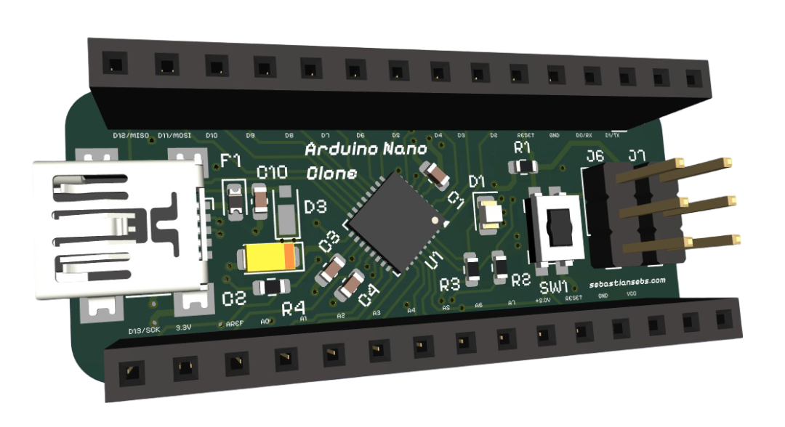
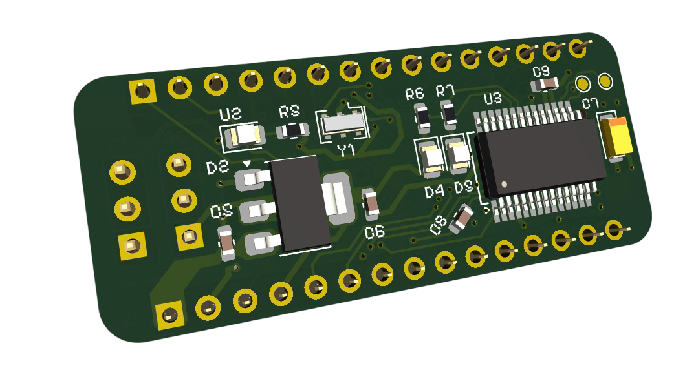
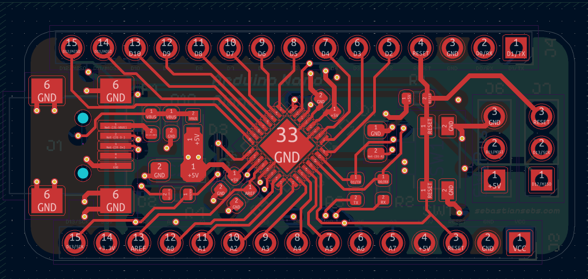
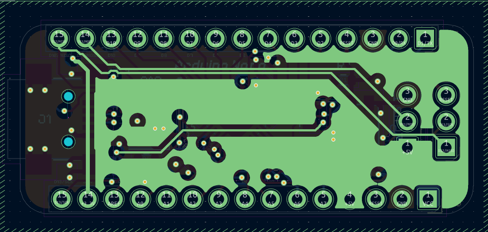
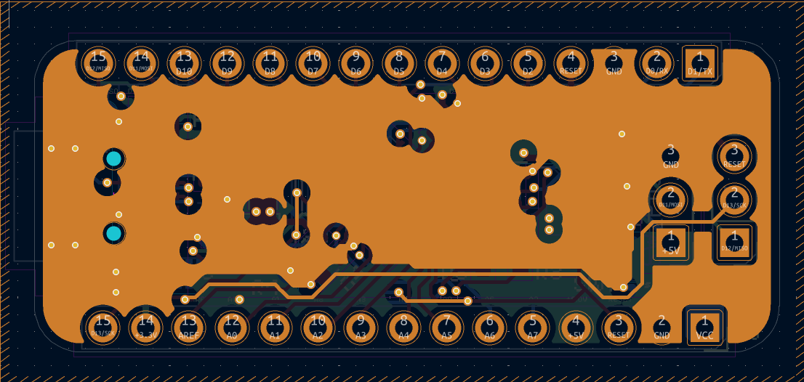
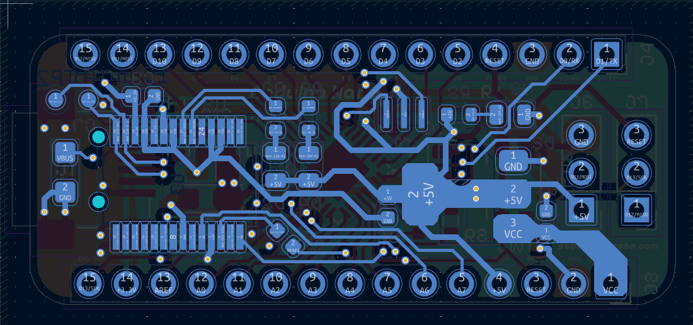

# Arduino Nano from Scratch

## Overview

This project describes a custom-designed microcontroller development board, similar to an Arduino Nano, based on the ATmega328P-M. The board integrates a stable 5V power supply, a USB-to-serial converter for programming and UART/SPI communication, and comprehensive pin headers for flexible interfacing.

  
  

## Project Architecture

The project is structured hierarchically within KiCad, with the following key sub-schematics:

1.  **Root:** The top-level schematic, connecting the main blocks.
2.  **Project Architecture:** Defines the overall system architecture.
    * **Pins:** Exposes the digital and analog I/O pins.
    * **Power Supply:** Provides a regulated 5V supply.
    * **USB Port:** Handles USB communication and power.
    * **Microcontroller:** Contains the ATmega328P-M and its supporting circuitry.

## PCB Layers

The PCB is meticulously designed with the following **4 layers** to optimize **signal integrity**, **power delivery networks (PDN)**, and **component density**, ensuring robust performance and manufacturability:

1.  **Layer Top (F.Cu - Front Copper):**
    * **Description:** This is the primary **component placement layer**, primarily accommodating **Surface Mount Devices (SMDs)** and **through-hole components**. It's strategically utilized for **critical high-speed signal routing**, **decoupling capacitor placement**, and minimizing trace lengths for **impedance control** on sensitive lines.
    * 

2.  **5V (In1.Cu - Inner Copper 1):**
    * **Description:** A dedicated **internal power plane** for the **+5V rail**. This continuous copper plane ensures **low-impedance power distribution**, minimizing **voltage ripple** and providing a robust, stable current source across the entire board, critical for **power integrity** of digital logic.
    * 

3.  **GND (In2.Cu - Inner Copper 2):**
    * **Description:** A comprehensive **internal ground plane**. This solid plane serves as a universal **low-impedance return path** for all signals, significantly reducing **electromagnetic interference (EMI)**, enhancing **electromagnetic compatibility (EMC)**, and providing effective **shielding** for sensitive traces.
    * 

4.  **Layer Bottom (B.Cu - Bottom Copper):**
    * **Description:** Utilized for completing **signal routing**, particularly for less sensitive signals or those requiring longer runs. This layer also accommodates additional **SMD component placement** and provides flexibility for **thermal management** via copper pours if needed.
    * 

## Key Components

* **U1:** ATmega328P-M Microcontroller
* **U2:** LM1117-5.0 Voltage Regulator
* **U3:** FT232RL USB-to-Serial Converter
* **J1:** USB Mini-B connector
* **J2, J4:** Main I/O Headers
* **J6, J7:** ICSP Headers

## Important Files

* `Arduino Nano.kicad_pro`: KiCad project file.
* `Arduino Nano.kicad_sch`: Top-level schematic.
* `Microcontroller.kicad_sch`, `Pins.kicad_sch`, `Power Supply.kicad_sch`, `USB Port.kicad_sch`: Hierarchical sub-schematic files.
* `Arduino Nano.kicad_pcb`: PCB layout file.
* `Arduino Nano.kicad_dru`: PCB design rules file.
* `Arduino Nano.kicad_prl`: Project-specific library settings.
